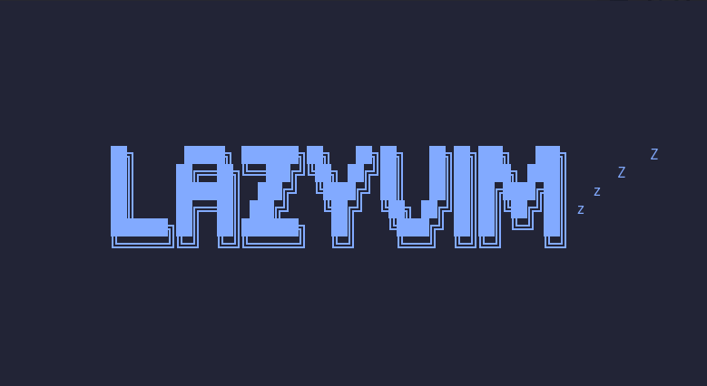

<div id="top"></div>
<br/>
<div align="center">
  <a href="https://github.com/fransjesky/sinclair">
    
  </a>
  <h1>lazyvim.config 💤</h1>
  <p align="center">
    This is a personalized Neovim configuration forked from <strong>LazyVim</strong>,<br/>tailored to suit my workflow and preferences
    <br />
    <a href="https://neovim.io/">Neovim</a>
    ·
    <a href="http://www.lazyvim.org/">LazyVim</a>
  </p>

[](https://github.com/fransjesky/lazyvim.config/LICENSE)

</div>

## ⚡️ Requirements

- Neovim
- Python
- Node and NPM
- Rust and Cargo for blink.nvim plugin installation.
- a **C** compiler for `nvim-treesitter`. See [here](https://github.com/nvim-treesitter/nvim-treesitter#requirements)

## 🚀 Getting Started

This is a forked starter pack of LazyVim.
<br />
You can find a starter template for **LazyVim** [here](https://github.com/LazyVim/starter)

Clone the repository

```sh
git clone git@github.com:fransjesky/lazyvim.config.git ~/.config/nvim
```

Run Neovim and let the plugins install and update automatically.
